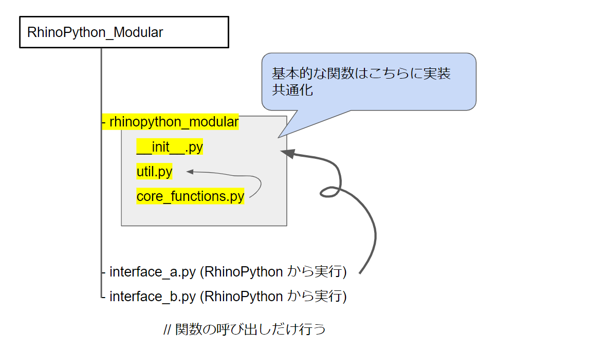

# RhinoPython_Modular  


RhinoPython、GhPython で自前モジュールを利用する。  
Windows 版では利用可。Mac 版ではできなかった気がする。  

  


### RhinoPython, GhPython でモジュールの更新が反映されない場合  

強制的にリロードする。  

```Python
### Python2
reload(module_name)
```


### モジュールにパスを通す（RhinoPython では不要？）  

RhinoPython では、.py ファイルが自分のパスを持っているので不要？  

```Python
################################################################

### RhinoPython
### Add Path for Modules

import os
import sys

### Get Current Directory
path_cd = os.getcwd()
#print(path_cd)

### Define Modular Path
path_module = "{}\\rhinopython_modular\\".format(path_cd)
#print(path_module)

sys.path.append(path_module)

################################################################

```


GhPython の中で Python を書くときには、コンポーネント内の Python コードは自分のパスを知らない。  
.gh ファイルの場所を取得し、そのパスを追加する必要がある。  

```Python
################################################################

### GhPython
### Add Path for Modules

import os
import sys

### Get Current Directory
path_cd = os.path.dirname(ghdoc.Path)
print(path_cd)


### Define Modular Path
path_module = "{}\\rhinopython_modular\\".format(path_cd)
#print(path_module)

sys.path.append(path_module)

################################################################

```
